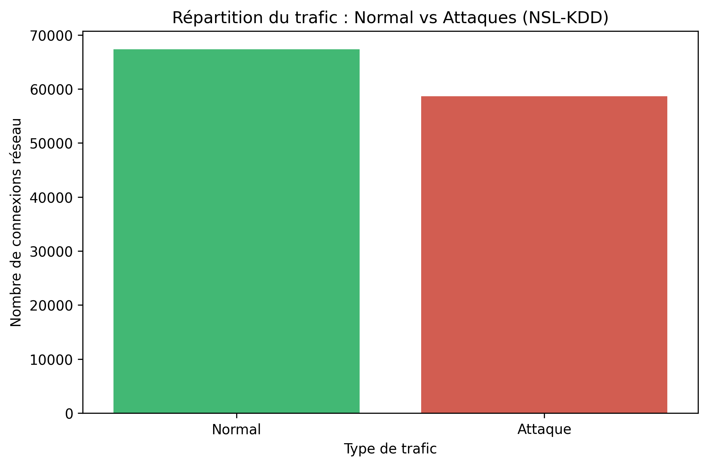

# 🛡️ ML Cyber Threat Detection System

## 📌 Description du projet
Ce projet consiste en la conception et le développement d'un système intelligent de détection et de prédiction des cybermenaces (IDS/IPS), spécialement conçu pour les startups et PME. Le système analyse les journaux d'activité réseau pour détecter en temps réel les comportements malveillants grâce à des modèles d'apprentissage automatique (Machine Learning).

## 🚀 Technologies utilisées
* **Machine Learning :** Scikit-learn, Pandas, Matplotlib, Seaborn
* **Backend :** Python, FastAPI *(À venir)*
* **Frontend :** React.js, TailwindCSS *(À venir)*
* **Déploiement :** Docker *(À venir)*

## 📂 Structure du projet
* `data/` : Jeux de données (ex: NSL-KDD) - *Non versionné sur Git*
* `notebooks/` : Analyse Exploratoire des Données (EDA) et tests des modèles.
* `images/` : Captures d'écran et graphiques générés.
* `src/` : Code source de l'application (API & Dashboard).
* `models/` : Modèles d'IA entraînés.

## 📊 Analyse Exploratoire (EDA)
Voici la répartition initiale du trafic (Normal vs Attaques) basée sur le dataset NSL-KDD :

---
*Projet réalisé dans le cadre du stage technique chez YaneCode Digital R&D Lab - 2026.*