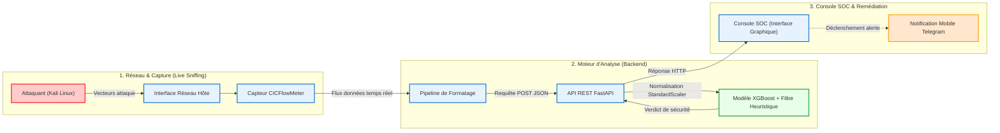

# 🛡️ YaneCode SOC - Système Intelligent de Détection d'Intrusions (NIDS)

## 1. Présentation du Projet

Ce projet s'inscrit dans le cadre de la conception et du développement d'un système intelligent de détection et de prévention des cybermenaces (IDS/IPS), optimisé pour les environnements PME et Startups.

Agissant comme un Security Operations Center (SOC) autonome, le système intercepte le trafic réseau en temps réel, extrait les caractéristiques comportementales des paquets, et s'appuie sur un modèle de Machine Learning (XGBoost) couplé à un moteur heuristique pour identifier, classifier et alerter instantanément sur les comportements malveillants.

---

## 2. Fonctionnalités Principales

- **Analyse en Temps Réel (Live Sniffing)**  
  Capture continue du trafic réseau et extraction instantanée de 78 métriques (features) via l'outil CICFlowMeter en arrière-plan.

- **Détection par Intelligence Artificielle**  
  Classification précise des flux (Trafic Normal, PortScan, DDoS, Brute Force SSH) à l'aide d'un modèle XGBoost entraîné, optimisé et validé sur le dataset CICIDS2017.

- **Moteur Heuristique Anti-Biais**  
  Application de règles déterministes (signatures) post-prédiction pour éliminer les faux positifs liés aux biais d'environnement et garantir une fiabilité d'alerte maximale.

- **Tableau de Bord Interactif**  
  Interface graphique de surveillance (Desktop App) développée en Python offrant une visualisation claire des statistiques de flux et un journal d'audit en temps réel.

- **Système de Notification (Alerte Mobile)**  
  Transmission automatisée, asynchrone et sécurisée des alertes critiques vers les administrateurs via l'API Telegram.

- **Déploiement Automatisé**  
  Script d'orchestration Bash permettant l'amorçage simultané des services (Backend, Capteur et Frontend) en une seule commande.

---

## 3. Technologies Employées

- **Moteur d'Intelligence Artificielle :** Python, XGBoost, Scikit-learn, Pandas, NumPy, Joblib.
- **Backend & API REST :** FastAPI, Uvicorn, Pydantic (Architecture asynchrone).
- **Interface Utilisateur (GUI) :** CustomTkinter.
- **Capture et Traitement Réseau :** CICFlowMeter, Tshark/Scapy.
- **Tests d'Intrusion & Validation :** Nmap, Apache Benchmark (ab), Hydra (déployés depuis un environnement virtuel Kali Linux).

---

## 4. Architecture du Système

Le diagramme ci-dessous illustre le flux de traitement des données, depuis la capture réseau jusqu'à la notification de l'administrateur :



---

## 5. Instructions de Déploiement

### Prérequis

- Un environnement virtuel Python 3.13.5 (`venv`) configuré avec les dépendances du fichier `requirements.txt`
- Des privilèges administrateur (`sudo`) pour permettre au capteur d'écouter les interfaces réseaux physiques

---

### Méthode 1 : Démarrage Automatisé (Recommandé)

Un script Bash a été développé pour orchestrer le lancement des trois composants majeurs du système (API, Sniffer, Interface) de manière fluide.

À la racine du projet, exécutez :

```bash
chmod +x start_soc.sh
./start_soc.sh
```

Le système vous demandera votre mot de passe administrateur pour initialiser le capteur réseau.

La fermeture de l'interface graphique entraînera l'arrêt propre de tous les processus en arrière-plan.

---

### Méthode 2 : Démarrage Manuel (Mode Développement)

Pour le débogage, les services peuvent être lancés séparément dans trois terminaux distincts.

#### Terminal 1 : Backend d'Inférence (API FastAPI)

```bash
./venv/bin/python -m uvicorn src.main:app --reload
```

#### Terminal 2 : Capteur Réseau (Sniffer)

```bash
sudo ./venv/bin/python live_sniffer.py
```

#### Terminal 3 : Console d'Administration (SOC)

```bash
./venv/bin/python src/desktop_app.py
```

Cliquez ensuite sur le bouton **"Lancer Mode LIVE"** dans l'interface graphique.

---

## 6. Dataset & Entraînement

Le modèle de Machine Learning a été entraîné et validé sur le dataset :

- **CICIDS2017** (Canadian Institute for Cybersecurity)

Les catégories principales détectées :

- Trafic Normal
- PortScan
- DDoS
- Brute Force SSH

Le pipeline inclut :

- Nettoyage des données
- Sélection des features
- Standardisation (`StandardScaler`)
- Entraînement XGBoost
- Sérialisation via `Joblib`

---

## 7. Sécurité & Objectifs

Ce projet a été conçu dans une optique :

- d'apprentissage avancé en cybersécurité défensive
- d'expérimentation IDS/IPS intelligent
- de démonstration SOC automatisé
- de détection temps réel assistée par IA

---

## 8. Auteur

**YaneCode / Zakaria KHATTAR**  
Projet IA & Cybersécurité — SOC Intelligent Temps Réel